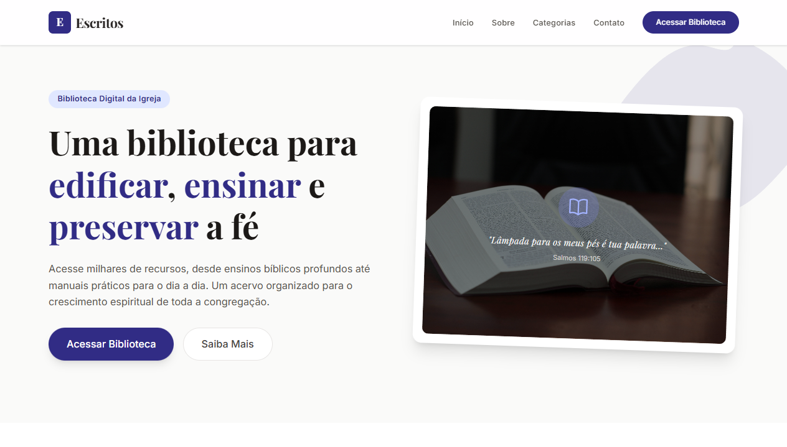
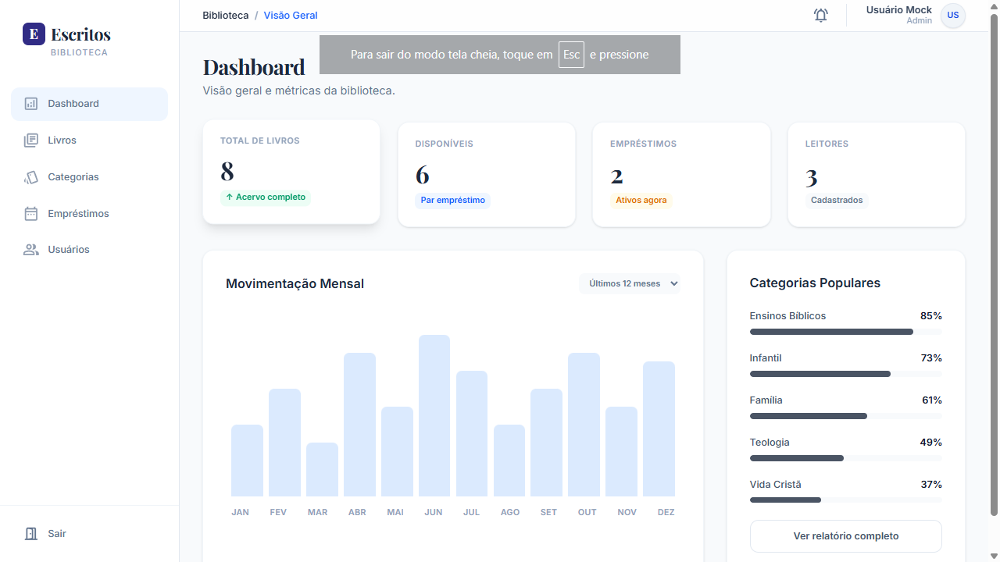

# Escritos

Este projeto foi gerado usando o [Angular CLI](https://github.com/angular/angular-cli) versão 21.0.3.

## Tela Inicial - Landing Page

## Tela Inicial - ERP

## Introdução

**Escritos** é um projeto de software para a Biblioteca de livros cristãos da Igreja Adventista do Sétimo Dia. Seu objetivo é facilitar o acesso literário e trazer incentivos a leitura, por meio da gamificação e metas diárias. 

Espera-se que o sistema ajude **cristãos** de qualquer instituição que seja a encontrarem aconchego entre os livros e auxílio no crescimento espiritual.

Com um ranking dos leitores mais assíduos e a possibilidade de criar metas pessoais buscamos criar o hábito de leitura. Além disso os relatórios e gráficos iniciais dão uma perspectiva geral para o usuário do acervo de livros.
